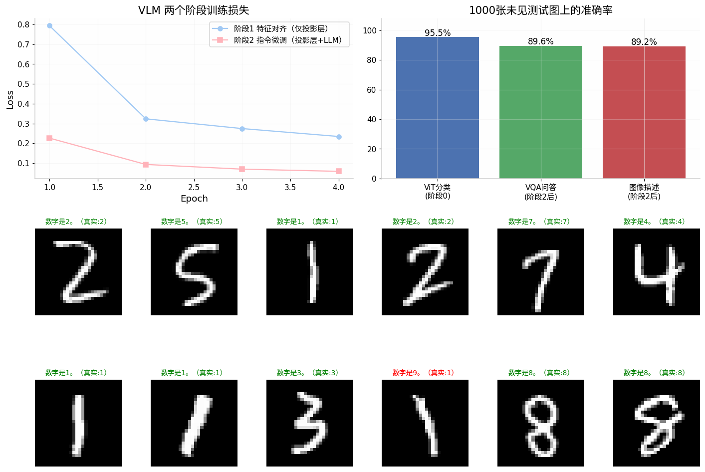

# 迷你 VLM 设计文档：从 ViT + RoPE-GPT 到视觉语言模型

> 基于两份教学代码（手写 RoPE-GPT 与 MNIST-ViT）改进拼装的最小可用 VLM，
> 在 CPU 上约 10 分钟完成全部训练，1000 张未见测试图上 VQA 准确率 89.6%。

## 1. 总体架构（LLaVA 式三段式）

```
图像 (1×28×28)
   │
   ▼
┌─────────────────┐   16 个 patch token（7×7 卷积切块 + 正弦位置编码 + 2 层双向注意力）
│  ViT 视觉编码器  │   输出: [B, 16, 64]
└────────┬────────┘
         ▼
┌─────────────────┐   Linear(64→64) → GELU → Linear(64→64)
│   投影层 MLP     │   输出: [B, 16, 64]（已对齐到 LLM 词嵌入空间）
└────────┬────────┘
         ▼  与文本 token embedding 拼接: [B, 16+T, 64]
┌─────────────────┐   2 层 Pre-Norm decoder，RoPE 旋转位置编码，加性因果掩码
│  RoPE-GPT 语言模型│  输出 logits → 自回归生成回答
└─────────────────┘
```

参数量：ViT 70,858 + 投影层 8,320 + LLM 102,938 ≈ **18.2 万**。

相对原始代码的四处必要改进：

| # | 改进 | 原因 |
|---|------|------|
| 1 | ViT 的 `pos_encoding` 改为 `register_buffer` | 原代码是普通属性，不进 `state_dict`，保存/加载模型会静默丢失 |
| 2 | PAD 与 EOS 分离（0/1 两个 id） | 原 GPT 中二者同为 0 且被 `ignore_index` 忽略，模型永远学不会主动停止生成 |
| 3 | RoPE-GPT 支持 `inputs_embeds` 输入 | 拼接图像 embedding 的前提（图像没有 token id，只有连续向量） |
| 4 | 去掉 RoPE 中冗余的 `repeat_interleave` | 与 apply 里的 `[::2]` 切片互相抵消，纯浪费 |

## 2. 投影层结构

### 2.1 选型：2 层 MLP（LLaVA-1.5 方案）

```python
nn.Sequential(
    nn.Linear(64, 64),   # 维度变换：视觉特征空间 -> LLM 嵌入空间
    nn.GELU(),           # 非线性（单层线性表达力不足，LLaVA-1.0 用单层后发现不够）
    nn.Linear(64, 64),   # 在目标空间内进一步整形
)
```

### 2.2 三种候选方案对比

| 方案 | 结构 | 参数量 | 特点 | 代表工作 |
|------|------|--------|------|----------|
| 单线性层 | `Linear(d_v→d_l)` | d_v·d_l | 最简，表达力弱，只适合特征已高度对齐的场景 | LLaVA-1.0 |
| **2 层 MLP（本实现）** | `Linear→GELU→Linear` | 2·d² | 性价比最高，主流默认 | LLaVA-1.5、InternVL |
| Q-Former / 交叉注意力 | 可学习 query 对视觉特征做注意力采样 | 数百万 | 可把任意长度视觉序列压缩成固定 K 个 token，但引入额外训练难度 | BLIP-2、Qwen-VL(早期) |

### 2.3 投影层到底在学什么

投影层的输入输出维度可以相同（这里都是 64），它的作用**不是降维，而是换空间**：
ViT 的特征空间按"视觉可分性"组织（哪个类的图像长什么样），LLM 的词嵌入空间按"语言共现"组织（什么字后面跟什么字）。投影层学习的是一个**语义翻译**：把"看起来是 7 的视觉特征"翻译成 LLM 词嵌入空间中"会让模型说出『7』这个位置"的向量。阶段 1 仅用 8,320 个参数就能把对齐损失从 0.79 降到 0.23，说明两个空间之间确实存在低复杂度的映射。

### 2.4 图像 token 如何进入序列

```
[img₁, img₂, ..., img₁₆, 描, 述, 这, 张, 图, 片, ：, 图, 中, 的, 数, 字, 是, 7, 。, <eos>]
 └─ 投影层输出，无 token id ─┘└── prompt（不计损失）──┘└─ answer（计损失）─┘
```

- 图像 embedding 直接拼在文本 embedding **前面**（prefix-LM 布局），全序列共用一套因果掩码与 RoPE 位置编号；
- 图像 token 位于序列最前，后续所有文本位置都能通过因果注意力看到全部图像信息；
- 不使用特殊 `<image>` 占位符，embedding 级拼接更直接（LLaVA 是把 `<image>` 位置的 embedding 替换掉，数学上等价）。

## 3. 训练步骤（分阶段，冻结/解冻矩阵）

| 阶段 | 目标 | 训练数据 | ViT | 投影层 | LLM | 可训参数 |
|------|------|----------|-----|--------|-----|----------|
| 0a 视觉预训练 | 教会"眼睛"认数字 | 60,000 MNIST 分类（带增强），6 epoch | ✅ 训练 | – | – | 7.1 万 |
| 0b 语言预训练 | 教会"嘴巴"说话模板 | 800 条纯文本句子，4 epoch | – | – | ✅ 训练 | 10.3 万 |
| **1 特征对齐** | 打通两个特征空间 | 6,000 条"描述"对，4 epoch | ❄️ 冻结 | ✅ **训练** | ❄️ 冻结 | **仅 8,320** |
| **2 指令微调** | 学会按指令回答 | 4,500 VQA + 2,250 描述（2:1 混合），4 epoch | ❄️ 冻结 | ✅ 训练 | 🔓 解冻 | 约 11 万 |

设计依据（与 LLaVA 完全一致）：

1. **阶段 1 冻结 LLM 是关键**。此时 LLM 已经"会说话"，唯一降低损失的路径是投影层把图像信息翻译成 LLM 能懂的向量——梯度信号干净地全部压给投影层。如果此时解冻 LLM，模型会走捷径（微调 LLM 去适应视觉特征），投影层学不到干净的对齐。
2. **冻结的模块同时切到 `eval()`**，关闭 dropout，保证前向特征稳定。
3. **ViT 全程冻结于阶段 1/2**：视觉编码器预训练充分后不再动，避免小数据上灾难性退化（真实 VLM 中也常冻结 ViT 或用极小学习率）。
4. **阶段 2 数据混合**：VQA 与描述数据 2:1 混合，防止单任务微调覆盖阶段 1 学到的描述能力（实测：不加混合时描述能力退化，回答从完整句子「图中的数字是7。」退化成「7。」）。

## 4. 训练方法

### 4.1 损失掩码（指令微调的核心约定）

只对 **answer 段 + EOS** 计算交叉熵，prompt 与图像位置标 `-100` 被忽略：

```python
labels[i, len(prompt):] = answer_ids     # prompt 段保持 -100
loss = F.cross_entropy(logits[:, :-1], full_labels[:, 1:], ignore_index=-100)
```

这让模型只学"怎么答"，不学"怎么问"——问句千奇百怪，答案格式才是要对齐的。

### 4.2 因果掩码与位置编码

全序列（图像+文本）共用一个上三角 `-inf` 加性因果掩码；RoPE 对 16 个图像 token 与文本统一编号（图像占 0–15 号位）。RoPE 的相对位置性质意味着"文本 token 回头看图像"的注意力强度只取决于相对距离，无需额外设计。

### 4.3 超参数

| 项目 | 值 |
|------|-----|
| 优化器 | AdamW（阶段2 weight_decay=0.01） |
| 学习率 | 阶段0a/0b/1: 1e-3；阶段2: 5e-4 |
| 批次 | 视觉预训练 256，其余 128 |
| 梯度裁剪 | 范数 1.0 |
| 调度 | 阶段0a 余弦退火 |

## 5. 训练数据

### 5.1 数据配方（模板 × MNIST 标签程序化合成）

```python
CAPTION_PROMPT = "描述这张图片："
CAPTION_TMPL   = "图中的数字是{d}。"
VQA_PAIRS = [
    ("图中是什么数字？",        "数字是{d}。"),
    ("这张图片里的手写数字是几？", "是{d}。"),
    ("请识别图中的手写数字：",    "{d}。"),
]
```

每条样本 = 随机抽一张 MNIST 图 + 随机选一个模板 + 填入真实标签。
**多种问法模板是必要的**：单一模板会让模型把"问句字符串"当成固定前缀背下来，换种问法就失效；多模板迫使模型真正依赖图像内容作答。

### 5.2 分词与词表

字级别分词器，词表 36（`<pad>/<eos>/<unk>` + 10 个数字 + 23 个汉字标点），由语料自动收集。演示场景下字级分词零成本且 OOV 可控；真实场景换 BPE/SentencePiece 即可，模型代码不用动。

### 5.3 与真实 VLM 数据的对照

| 阶段 | 本实现 | LLaVA-1.5 |
|------|--------|-----------|
| 对齐 | 6,000 条单图单句描述 | 595K 图文对（CC3M 过滤） |
| 指令微调 | 6,750 条模板 VQA | 158K 人工/GPT-4 指令数据 |
| 结论 | 数据配方结构一致，只是规模差 5 个数量级 | — |

## 6. 训练结果

- 阶段 1 对齐损失：0.79 → 0.23（4 epoch）
- 阶段 2 微调损失：0.23 → 0.06（4 epoch）
- **ViT 分类 95.5% / VQA 89.6% / 图像描述 89.2%**（1000 张未见测试图）



### 实验中复现的两个经典现象

1. **误差沿模块链传导**：第一版 ViT 只训到 79.9%，VQA 即被卡到 75.7%；把 ViT 提升到 95.5% 后 VQA 升至 89.6%。VLM 的端到端指标 ≈ 最弱模块的指标，定位瓶颈永远是第一步。
2. **灾难性遗忘与数据混合**：阶段 2 只训 VQA 短答案时，阶段 1 学到的完整描述能力立刻退化；按 2:1 混入描述数据后两种能力共存。这正是真实指令微调强调 data mixture 的原因。

## 7. 运行方式

```bash
python MiniVLM_train.py    # MNIST 由 torchvision 自动下载到 ./data
```

- `mini_vlm.py`：CharTokenizer / RoPE-GPT / ViTEncoder / Projector / MiniVLM
- `MiniVLM_train.py`：四个训练阶段 + 评估，产出 `ckpt/mini_vlm_final.pt` 与 `ckpt/train_log.json`
- 全程 CPU 约 10 分钟，无需 GPU

## 8. 后续可扩展方向

1. 投影层升级为交叉注意力（Q-Former 式），把 16 个图像 token 压缩到 4 个，对比效果与速度；
2. 图像改为两张 MNIST 左右拼接，任务升级为"读出两个数字"，检验空间顺序建模；
3. 给 LLM 加 KV cache，对比生成耗时；
4. 用 `return_attn` 钩子可视化文本 token 对 16 个 patch 的注意力图，直观看到"模型看哪里"。
